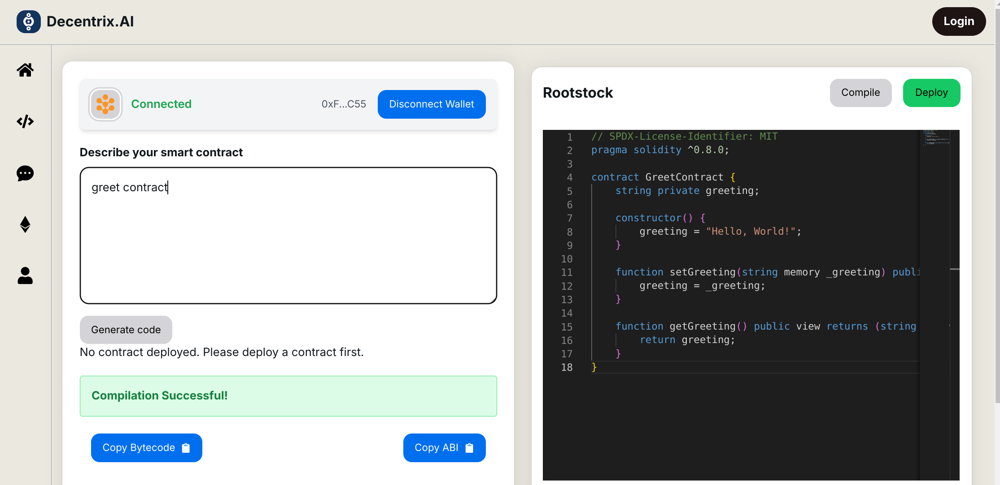
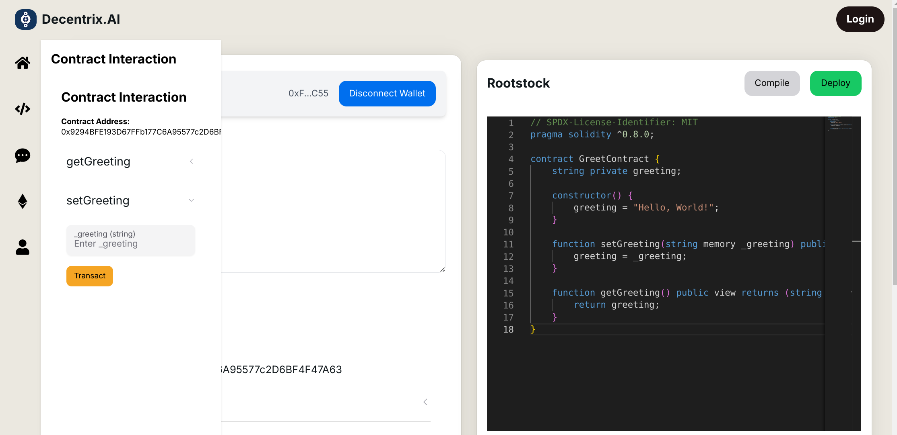

# Decentrix.AI

Welcome to Decentrix.AI - Your Ultimate AI-Powered Blockchain Development Companion

## About

Decentrix.AI is designed to streamline the blockchain development process, making it accessible and efficient for developers of all levels. Whether you're new to blockchain or an experienced developer, Decentrix.AI provides the tools and assistance you need to bring your ideas to life on various blockchain platforms.

## Features

### 1. AI-Powered Smart Contract Generator
- Describe your contract requirements in natural language
- Our AI agent will generate a fully functional smart contract based on your description
- Supports multiple blockchain platforms

### 2. One-Click Compile and Deploy
- Compile your smart contracts with a single click
- Automated error handling and suggestions for fixes
- Seamless deployment to your chosen blockchain
- Interaction with the contract directly from the platform

### 3. Dedicated Chain-Specific AI Agents

https://github.com/user-attachments/assets/e2982636-9cff-438a-a848-4d24bc86e046

- Specialized AI agents with in-depth knowledge of specific blockchain platforms
- Get instant answers to your questions without sifting through complex documentation
- Receive platform-specific best practices and optimization tips

### 4. Interactive Learning and Development
- Learn as you build with context-aware suggestions and explanations
- Explore blockchain concepts and features through guided interactions

## Getting Started

1. Visit [Decentrix.AI](https://decentrix.ai)
2. Sign up for an account or log in
3. Choose your preferred blockchain platform
4. Start building your smart contract or explore the platform's features

## Supported Blockchain Platforms
- Rootstock
- Hedera
- Blockless

## How It Works

# Code Generation
1. **Describe Your Contract**: Tell our AI what you want your smart contract to do.
2. **Generate Code**: Our AI will create a smart contract based on your description.
3. **Review and Customize**: Make any necessary adjustments to the generated code.
4. **Compile and Test**: Use our one-click compilation feature to check for errors.
5. **Deploy**: Deploy your contract to your chosen blockchain with ease.

# Platform Assistance
1. **Ask Questions**: Pose your questions to our platform-specific AI agents.
2. **Get Answers**: Receive  responses with detailed explanations, code and links to relevant resources.

## Benefits

- **Time-Saving**: Reduce development time with AI-generated contracts and quick deployment. Say no to reading lengthy documentation.
- **Learning Tool**: Perfect for beginners to understand smart contract development.
- **Error Reduction**: AI-assisted coding and compilation help minimize errors.
- **Platform Expertise**: Gain insights into different blockchain platforms without extensive research.

## License

Decentrix.AI is released under the [MIT License](LICENSE).

---

Ready to revolutionize your blockchain development experience? Get started with Decentrix.AI today!
